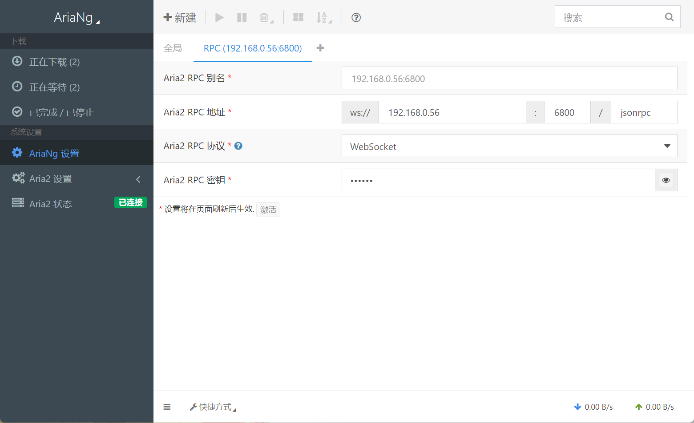

# aria2 下载服务器搭建

### 树莓派环境下搭建 aria2 下载服务器及 ariaNg 前端界面

下载 aria2 和 nginx

```
apt install aria2
apt install nginx

```

进入 nginx 项目目录，下载 ariaNg 压缩包并解压

```
cd /var/www/html/
wget https://github.com/mayswind/AriaNg/releases/download/1.2.4/AriaNg-1.2.4-AllInOne.zip
unzip AriaNg-1.2.4-AllInOne.zip
```

启动 ariaNg 前端 Web 服务

```
systemctl start nginx
systemctl enable nginx
```

启动 aria2 后端服务并设置密码

```
aria2c --enable-rpc --rpc-listen-all --rpc-secret yourPassword
```

在 ariaNg 上配置 ip 及刚才输入的密码即可


