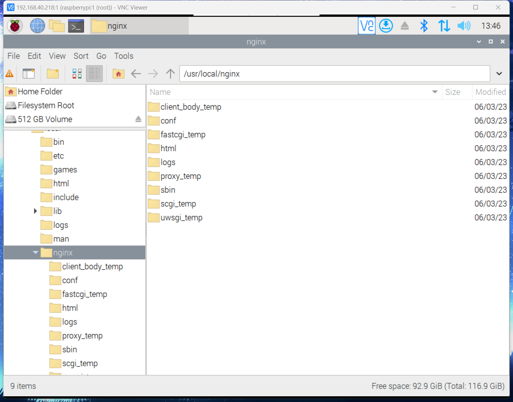

# nginx インストール

ダウンロードしたインストールパッケージを解凍

```shell
tar -zxvf nginx-1.22.1.tar.gz
```

依存ライブラリをダウンロード

```shell
apt-get install libpcre3 libpcre3-dev
```

./configure を実行

```shell
./configure --prefix=/usr/local/nginx
```

コンパイル

```shell
make
```

インストール

```shell
make install
```

/usr/local/nginx でインストール完了

