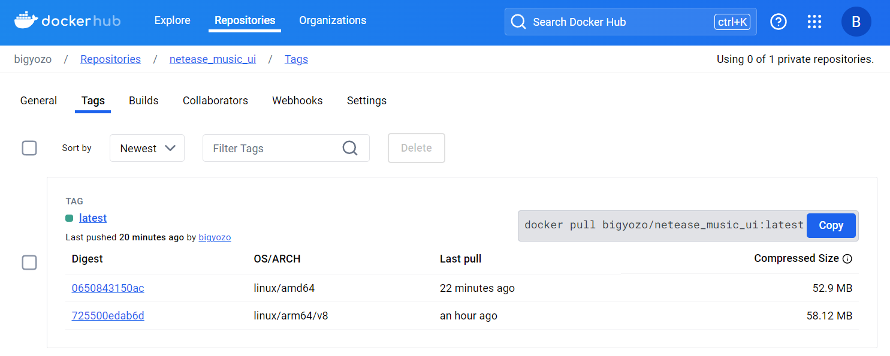

# 多架构(Multi-Arch)的容器镜像创建

### 使用 docker manifest 方式实现多架构的容器镜像共用同一个 tag

分别在 x64 与 arm 的服务器上构建镜像并上传

```
# AMD64
$ docker build -t your-username/multiarch-example:manifest-amd64 --build-arg ARCH=amd64/ .
$ docker push your-username/multiarch-example:manifest-amd64

# ARM64V8
$ docker build -t your-username/multiarch-example:manifest-arm64v8 --build-arg ARCH=arm64v8/ .
$ docker push your-username/multiarch-example:manifest-arm64v8
```

创建指向不同 CPU 架构镜像的 manifests list 对象

```
$ docker manifest create \
your-username/multiarch-example:latest \
--amend your-username/multiarch-example:manifest-amd64 \
--amend your-username/multiarch-example:manifest-arm64v8
```

将 manifests list 对象 push 到 docker hub

```
$ docker manifest push your-username/multiarch-example:latest
```

登录到 dockerhub，可以看到多架构的镜像在共用同一个 tag


